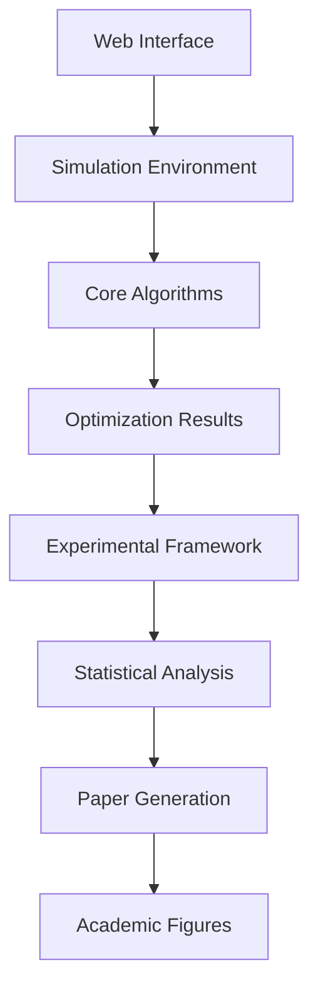

# System Architecture

This document describes the technical architecture of the Drone Optimization SimulationSystem.

## 🏗️ Overall Architecture

### System Components
```
SimulationSystem/
├── 🧠 Core Algorithms (algorithms.py)
├── 🌐 Web Interface (app.py)  
├── 🧪 Experimental Framework (comprehensive_experimental.py)
├── 📊 Paper Generation (automatic_academic_paper_generator.py)
├── 📈 Visualization (paper_generation/)
└── 📚 Documentation (documentation/)
```

### Component Relationships


## 🧠 Core Algorithm Architecture

### Algorithm Categories
```python
# Smart Algorithms (AI-Enhanced)
smart_algorithms = [
    'smart_greedy_position_optimization',      # Best performer
    'smart_coverage_position_optimization',    # Coverage-focused
    'staged_genetic',                          # Multi-stage approach
]

# Traditional Optimizers  
traditional_algorithms = [
    'standard_genetic',                        # Genetic Algorithm
    'standard_pso',                           # Particle Swarm Optimization
    'standard_ga_sa',                         # GA + Simulated Annealing
]

# Hybrid Approaches
hybrid_algorithms = [
    'staged_genetic_with_refinement',         # Enhanced staging
    'smart_greedy_with_local_search',        # Local optimization
    'standard_sa_with_adaptive_temp',        # Adaptive cooling
]
```

### Parameter Architecture
```python
class OptimizationParams:
    """Base class for algorithm parameters"""
    MAX_ITERATIONS = 1000
    DEFAULT_TOLERANCE = 1e-6
    CONVERGENCE_WINDOW = 10

class GeneticParams(OptimizationParams):
    """Genetic Algorithm parameters"""
    POPULATION_SIZE = 50
    NUM_GENERATIONS = 200
    MUTATION_RATE = 0.1
    CROSSOVER_RATE = 0.8

class PSOParams(OptimizationParams):
    """Particle Swarm Optimization parameters"""
    SWARM_SIZE = 30
    INERTIA_WEIGHT = 0.7
    COGNITIVE_COEFF = 1.5
    SOCIAL_COEFF = 1.5
```

### Algorithm Interface
```python
def algorithm_interface(simulation_env, **kwargs):
    """Standard algorithm interface"""
    # Input: DroneSimulationEnvironment
    # Output: (activation_array, OptimizationResult)
    
    activation = np.zeros(simulation_env.num_drones, dtype=bool)
    result = OptimizationResult(
        coverage=float,
        active_drones=int,
        total_time=float,
        iterations_used=int,
        converged=bool
    )
    
    return activation, result
```

## 🌐 Simulation Environment Architecture

### Core Environment Class
```python
class DroneSimulationEnvironment:
    def __init__(self, area_width, area_height, num_drones, drone_range):
        self.area_width = area_width
        self.area_height = area_height
        self.num_drones = num_drones
        self.drone_range = drone_range
        
        # Internal state
        self.drone_positions = self._generate_random_positions()
        self.coverage_grid = self._initialize_grid()
        self.adjacency_matrix = self._compute_adjacency()
```

### Coverage Calculation
```python
def calculate_coverage(self, activation):
    """Calculate total coverage percentage"""
    covered_cells = set()
    
    for i, active in enumerate(activation):
        if active:
            drone_coverage = self._get_drone_coverage(i)
            covered_cells.update(drone_coverage)
    
    total_cells = self.area_width * self.area_height
    coverage_percentage = len(covered_cells) / total_cells * 100
    
    return coverage_percentage
```

### Position Optimization
```python
def optimize_positions(self, activation, method='gradient_descent'):
    """Optimize drone positions for better coverage"""
    active_drones = np.where(activation)[0]
    
    for iteration in range(MAX_POSITION_ITERATIONS):
        gradients = self._compute_coverage_gradients(active_drones)
        new_positions = self._update_positions(active_drones, gradients)
        
        if self._convergence_check(new_positions):
            break
    
    return new_positions
```

## 🧪 Experimental Framework Architecture

### Experiment Orchestration
```python
class ComprehensiveExperimentRunner:
    def __init__(self):
        self.algorithms = self._load_algorithms()
        self.scenarios = self._load_scenarios()
        self.results_storage = ResultsManager()
    
    def run_complete_suite(self):
        """Run all 168 experiments (14 algorithms × 6 scenarios × 2 runs)"""
        total_experiments = len(self.algorithms) * len(self.scenarios) * 2
        
        for algorithm in self.algorithms:
            for scenario in self.scenarios:
                for run in range(2):  # Two runs per combination
                    result = self._run_single_experiment(algorithm, scenario, run)
                    self.results_storage.save(result)
```

### Results Management
```python
class ResultsManager:
    def __init__(self, base_path="results/"):
        self.base_path = base_path
        self.timestamp = datetime.now().strftime("%Y%m%d_%H%M%S")
        self.experiment_folder = f"{base_path}comprehensive_experiment_{self.timestamp}/"
    
    def save_detailed_results(self, results):
        """Save complete experimental data"""
        df = pd.DataFrame(results)
        df.to_csv(f"{self.experiment_folder}detailed_results.csv", index=False)
    
    def generate_summary(self, results):
        """Generate executive summary"""
        summary = self._compute_statistics(results)
        with open(f"{self.experiment_folder}executive_summary.txt", 'w') as f:
            f.write(self._format_summary(summary))
```

### Statistical Analysis Pipeline
```python
class StatisticalAnalyzer:
    def __init__(self, results_data):
        self.data = results_data
        self.algorithms = results_data['Algorithm'].unique()
    
    def compute_algorithm_rankings(self):
        """Rank algorithms by performance"""
        rankings = self.data.groupby('Algorithm').agg({
            'Coverage': ['mean', 'std', 'count'],
            'Active_Drones': 'mean',
            'Execution_Time': 'mean'
        }).round(2)
        
        return rankings.sort_values(('Coverage', 'mean'), ascending=False)
    
    def perform_significance_tests(self):
        """Statistical significance testing"""
        from scipy.stats import mannwhitneyu
        
        significance_matrix = np.zeros((len(self.algorithms), len(self.algorithms)))
        
        for i, alg1 in enumerate(self.algorithms):
            for j, alg2 in enumerate(self.algorithms):
                if i != j:
                    data1 = self.data[self.data['Algorithm'] == alg1]['Coverage']
                    data2 = self.data[self.data['Algorithm'] == alg2]['Coverage']
                    _, p_value = mannwhitneyu(data1, data2)
                    significance_matrix[i, j] = p_value
        
        return significance_matrix
```

## 📊 Paper Generation Architecture

### Academic Paper Generator
```python
class AutomaticAcademicPaperGenerator:
    def __init__(self):
        self.template_manager = TemplateManager()
        self.figure_generator = AcademicFigureGenerator()
        self.content_generator = ContentGenerator()
        self.formatter = IEEEFormatter()
    
    def generate_complete_paper(self, results_folder):
        """Generate complete IEEE-style paper"""
        # 1. Load and validate results
        results = self._load_results(results_folder)
        
        # 2. Generate statistical analysis
        statistics = self._compute_statistics(results)
        
        # 3. Create publication-ready figures
        figures = self.figure_generator.create_all_figures(results, statistics)
        
        # 4. Generate paper content
        content = self.content_generator.generate_all_sections(results, statistics)
        
        # 5. Format and save
        paper_path = self.formatter.create_formatted_document(content, figures)
        
        return paper_path
```

### Figure Generation Pipeline
```python
class AcademicFigureGenerator:
    def __init__(self):
        self.style_config = self._load_publication_style()
        self.color_scheme = self._load_professional_colors()
    
    def create_performance_comparison_figure(self, results):
        """Create 4-panel performance comparison"""
        fig, axes = plt.subplots(2, 2, figsize=(12, 10))
        
        # Panel A: Coverage comparison
        self._plot_coverage_comparison(axes[0,0], results)
        
        # Panel B: Active drones analysis
        self._plot_active_drones_analysis(axes[0,1], results)
        
        # Panel C: Execution time comparison
        self._plot_execution_time_comparison(axes[1,0], results)
        
        # Panel D: Efficiency metrics
        self._plot_efficiency_metrics(axes[1,1], results)
        
        # Apply professional formatting
        self._apply_ieee_formatting(fig)
        
        return fig
```

### Content Generation System
```python
class ContentGenerator:
    def __init__(self):
        self.templates = self._load_templates()
        self.citation_manager = CitationManager()
    
    def generate_abstract(self, results_summary):
        """Generate IEEE-style abstract"""
        template = self.templates['abstract']
        
        context = {
            'num_algorithms': len(results_summary['algorithms']),
            'num_scenarios': len(results_summary['scenarios']),
            'total_experiments': results_summary['total_experiments'],
            'best_algorithm': results_summary['best_algorithm'],
            'best_coverage': results_summary['best_coverage'],
            'improvement': results_summary['improvement_over_baseline']
        }
        
        return template.format(**context)
    
    def generate_methodology_section(self, algorithms, scenarios):
        """Generate detailed methodology"""
        content = []
        
        # Problem formulation
        content.append(self._generate_problem_formulation())
        
        # Algorithm descriptions
        content.append(self._generate_algorithm_descriptions(algorithms))
        
        # Experimental design
        content.append(self._generate_experimental_design(scenarios))
        
        # Evaluation metrics
        content.append(self._generate_evaluation_metrics())
        
        return "\n\n".join(content)
```

## 🔧 Configuration Management

### Global Configuration
```python
class Config:
    # Simulation parameters
    DEFAULT_GRID_RESOLUTION = 1.0
    MAX_POSITION_ITERATIONS = 30
    POSITION_OPTIMIZATION_TOLERANCE = 0.01
    
    # Algorithm parameters
    MAX_ALGORITHM_ITERATIONS = 1000
    CONVERGENCE_TOLERANCE = 1e-6
    CONVERGENCE_WINDOW = 10
    
    # Experimental parameters
    EXPERIMENTS_PER_COMBINATION = 2
    RESULTS_RETENTION_DAYS = 30
    
    # Paper generation
    FIGURE_DPI = 300
    FIGURE_FORMAT = 'png'
    PAPER_TEMPLATE = 'ieee_standard'
```

### Environment-Specific Settings
```python
class EnvironmentConfig:
    DEVELOPMENT = {
        'debug_mode': True,
        'reduced_iterations': True,
        'save_intermediate_results': True
    }
    
    PRODUCTION = {
        'debug_mode': False,
        'full_iterations': True,
        'optimize_performance': True
    }
    
    RESEARCH = {
        'extensive_logging': True,
        'statistical_validation': True,
        'publication_quality': True
    }
```

## 📈 Performance Optimization

### Algorithm Performance
```python
class PerformanceOptimizer:
    def optimize_genetic_algorithm(self, params):
        """Optimize GA parameters for performance"""
        if params.parallel_processing:
            # Use multiprocessing for population evaluation
            pool = multiprocessing.Pool()
            fitness_values = pool.map(evaluate_individual, population)
            pool.close()
        
        # Adaptive parameter tuning
        if params.adaptive_parameters:
            params.mutation_rate = self._adapt_mutation_rate(generation, fitness_trend)
            params.crossover_rate = self._adapt_crossover_rate(diversity_measure)
    
    def optimize_memory_usage(self):
        """Optimize memory usage for large experiments"""
        # Use generators for large datasets
        # Implement result streaming
        # Clear intermediate variables
        gc.collect()
```

### Parallel Processing
```python
class ParallelExecutionManager:
    def __init__(self, num_workers=None):
        self.num_workers = num_workers or multiprocessing.cpu_count()
        self.pool = multiprocessing.Pool(self.num_workers)
    
    def parallel_algorithm_execution(self, algorithm_func, scenarios):
        """Execute algorithm on multiple scenarios in parallel"""
        tasks = [(algorithm_func, scenario) for scenario in scenarios]
        results = self.pool.starmap(self._execute_single_task, tasks)
        return results
    
    def parallel_population_evaluation(self, population, fitness_func):
        """Evaluate GA population in parallel"""
        fitness_values = self.pool.map(fitness_func, population)
        return fitness_values
```

## 🔒 Error Handling and Validation

### Robust Error Handling
```python
class ExperimentErrorHandler:
    def __init__(self):
        self.error_log = []
        self.recovery_strategies = self._load_recovery_strategies()
    
    def handle_algorithm_error(self, algorithm_name, error, context):
        """Handle algorithm execution errors"""
        self.error_log.append({
            'timestamp': datetime.now(),
            'algorithm': algorithm_name,
            'error_type': type(error).__name__,
            'error_message': str(error),
            'context': context
        })
        
        # Attempt recovery
        recovery_strategy = self.recovery_strategies.get(type(error))
        if recovery_strategy:
            return recovery_strategy(algorithm_name, context)
        else:
            return self._default_recovery(algorithm_name, context)
```

### Data Validation
```python
class DataValidator:
    def validate_simulation_environment(self, env):
        """Validate simulation environment parameters"""
        assert env.area_width > 0, "Area width must be positive"
        assert env.area_height > 0, "Area height must be positive"
        assert env.num_drones > 0, "Number of drones must be positive"
        assert env.drone_range > 0, "Drone range must be positive"
        
        # Validate drone positions
        for pos in env.drone_positions:
            assert 0 <= pos[0] <= env.area_width, "Drone x position out of bounds"
            assert 0 <= pos[1] <= env.area_height, "Drone y position out of bounds"
    
    def validate_algorithm_result(self, activation, result):
        """Validate algorithm output"""
        assert len(activation) == self.num_drones, "Activation array size mismatch"
        assert isinstance(activation, np.ndarray), "Activation must be numpy array"
        assert activation.dtype == bool, "Activation must be boolean array"
        
        assert 0 <= result.coverage <= 100, "Coverage must be between 0-100%"
        assert result.active_drones >= 0, "Active drones must be non-negative"
        assert result.total_time >= 0, "Execution time must be non-negative"
```

## 🔍 Monitoring and Logging

### Comprehensive Logging
```python
class ExperimentLogger:
    def __init__(self, log_level='INFO'):
        self.logger = logging.getLogger('SimulationSystem')
        self.logger.setLevel(log_level)
        
        # File handler for persistent logging
        file_handler = logging.FileHandler('experiment.log')
        formatter = logging.Formatter(
            '%(asctime)s - %(name)s - %(levelname)s - %(message)s'
        )
        file_handler.setFormatter(formatter)
        self.logger.addHandler(file_handler)
    
    def log_experiment_start(self, experiment_id, algorithm, scenario):
        """Log experiment start"""
        self.logger.info(f"Starting experiment {experiment_id}: {algorithm} on {scenario}")
    
    def log_algorithm_progress(self, algorithm, iteration, coverage):
        """Log algorithm progress"""
        self.logger.debug(f"{algorithm} - Iteration {iteration}: Coverage {coverage:.2f}%")
    
    def log_experiment_completion(self, experiment_id, result):
        """Log experiment completion"""
        self.logger.info(f"Completed experiment {experiment_id}: "
                        f"Coverage {result.coverage:.2f}%, "
                        f"Time {result.total_time:.2f}s")
```

### Performance Monitoring
```python
class PerformanceMonitor:
    def __init__(self):
        self.metrics = {}
        self.start_times = {}
    
    def start_timing(self, operation):
        """Start timing an operation"""
        self.start_times[operation] = time.time()
    
    def end_timing(self, operation):
        """End timing and record duration"""
        if operation in self.start_times:
            duration = time.time() - self.start_times[operation]
            self.metrics[operation] = self.metrics.get(operation, []) + [duration]
            del self.start_times[operation]
    
    def get_performance_summary(self):
        """Get performance summary"""
        summary = {}
        for operation, times in self.metrics.items():
            summary[operation] = {
                'mean_time': np.mean(times),
                'std_time': np.std(times),
                'total_calls': len(times),
                'total_time': np.sum(times)
            }
        return summary
```

---
*For implementation details, see [Algorithm Implementation](./algorithm-implementation.md) and [API Documentation](../api/)*
